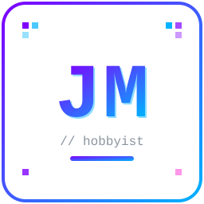

  

<h1 align="center">JM</h1>

  <picture>
    <source media="(prefers-color-scheme: dark)" srcset="https://readme-typing-svg.demolab.com?font=Fira+Code&size=21&pause=1000&color=7FFFD4&center=true&vCenter=true&width=650&lines=programo+por+hobby%2C+no+por+chamba;me+gusta+cacharrear+hasta+entender+c%C3%B3mo+funciona;I+code+for+fun+%26+curiosity" />
    
  </picture>

  

---

### 👋 Hola, soy JM

Programador hobbyista. Aprendo por pasión, no por título. Me gusta abrir las cosas, romperlas un poco y entender la lógica detrás de lo que hago.

Uso herramientas como **OpenCode** y **Antigravity** para ir más rápido, pero me clavo en entender el porqué del código, no solo en que jale.

> *I just like figuring out how stuff works.*

---

### 🛠️ Stack

  

**En lo que ando:** un poco de todo — webs, apps, bots, automatizaciones (poquito, ~3%) y scripts sueltos.

**Con apoyo de:** `OpenCode` · `Antigravity`

---

### 📌 Proyectos destacados

> Los repos se publican pronto. Esto es placeholder para no dejarlo vacío.

| Proyecto | Qué es | Estado |
|---|---|---|
| [Proyecto 1](https://github.com/JMX234-spe/Proyecto-1) | Descripción corta: qué hace y con qué lenguaje. | 🚧 en camino |
| [Proyecto 2](https://github.com/JMX234-spe/Proyecto-2) | Descripción corta: bot / web / app / script. | 💡 idea |
| [Proyecto 3](https://github.com/JMX234-spe/Proyecto-3) | Descripción corta: automatización o experimento. | 🚧 en camino |
| [Proyecto 4](https://github.com/JMX234-spe/Proyecto-4) | Descripción corta: algo que te dio curiosidad. | 💡 idea |

<!-- Cuando subas repos reales: cambia el link, pon 1 línea de qué hace y el lenguaje principal. No pongas más de 4, se ve mejor curado que lleno. -->

---

### 📊 Stats

  <picture>
    <source media="(prefers-color-scheme: dark)" srcset="https://github-readme-stats.vercel.app/api?username=JMX234-spe&show_icons=true&theme=tokyonight&hide_border=true&bg_color=00000000&title_color=7FFFD4&icon_color=7F00FF" />
    
  </picture>
  <picture>
    <source media="(prefers-color-scheme: dark)" srcset="https://streak-stats.demolab.com?user=JMX234-spe&theme=tokyonight&hide_border=true&background=00000000&ring=7F00FF&fire=FF7CE5&currStreakLabel=7FFFD4" />
    
  </picture>

  <picture>
    <source media="(prefers-color-scheme: dark)" srcset="https://github-readme-stats.vercel.app/api/top-langs/?username=JMX234-spe&layout=compact&theme=tokyonight&hide_border=true&bg_color=00000000&title_color=7FFFD4" />
    
  </picture>

> Recién empiezo aquí, así que se ven vacías. Se llenan solas cuando suba código.

  <picture>
    <source media="(prefers-color-scheme: dark)" srcset="https://raw.githubusercontent.com/JMX234-spe/JMX234-spe/output/snake-dark.svg" />
    
  </picture>

---

### 📫 Dónde encontrarme

Solo por aquí, nada de LinkedIn ni correo:

